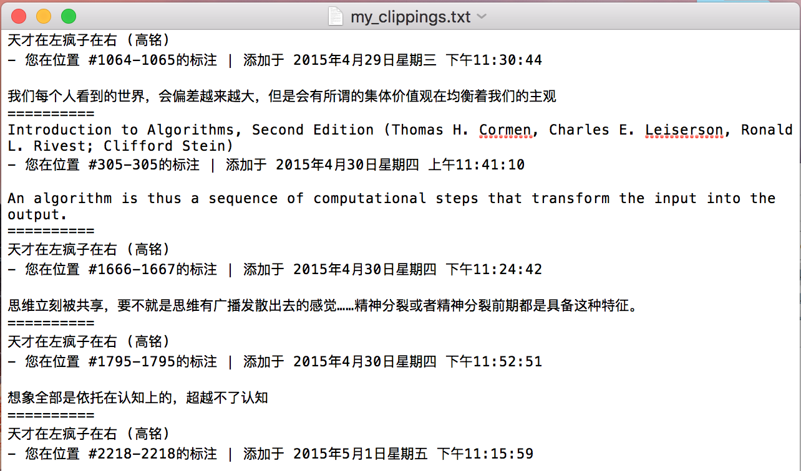
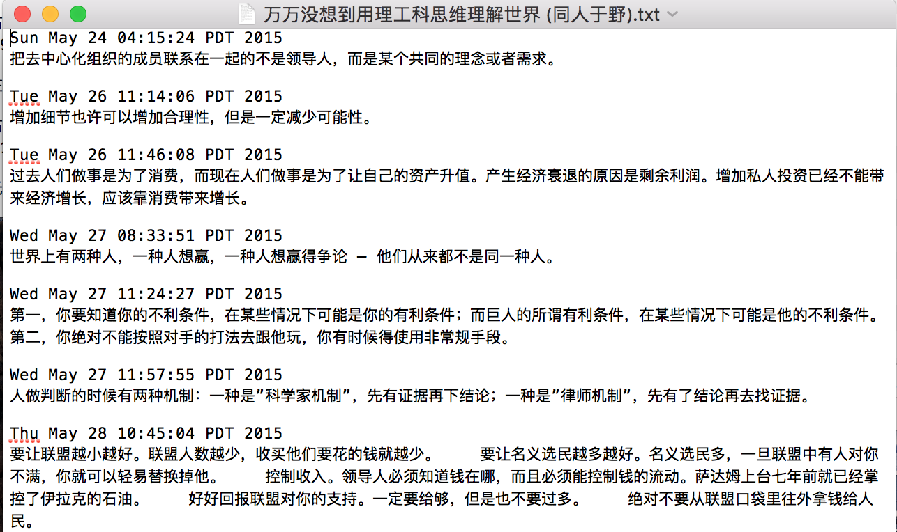

### Kindle Note Parser
*This repo is for personal use, not optimized to handle all cases and languages yet*

Although Kindle automatically generates clippings when readers highlight certain texts and stores them, they all 
exists in one txt file for all books, which makes it difficult to keep track when you are reading multiple books 
during a period of date.

This parser helps to divide highlights from different books into different txt files, which makes it easy to be 
maintained and reviewed.

***Difference from clippings.io:***
- For clippings.io, each note item need to either include all affiliated information including
 `book title, author, page, time` or non at all. As it matters the most when the note was made, only time is retained 
 in current version for output.
- The highlights or notes made within 5 minutes will be aggregated as one paragraph in output files, since they are 
usually highly correlated, either in same section of an essay, or bullet points regarding one topic but are not 
consecutive in text.

***Notice***
- For time of highlighting, current version only support English and Chinese date formats.

####How To Use

`javac FileProcessor.java`

`java FileProcessor <Path for My Clippings.txt> <Directory to store separated notes>`

**Source Clippings file format**

**Parsed Notes format**
